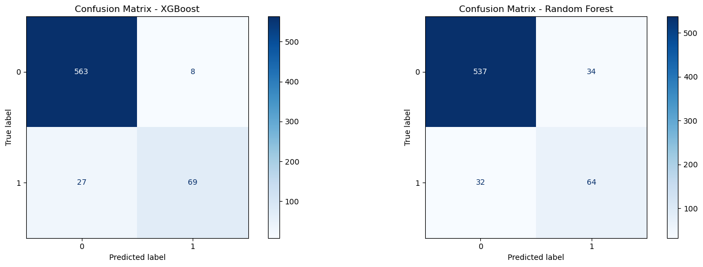
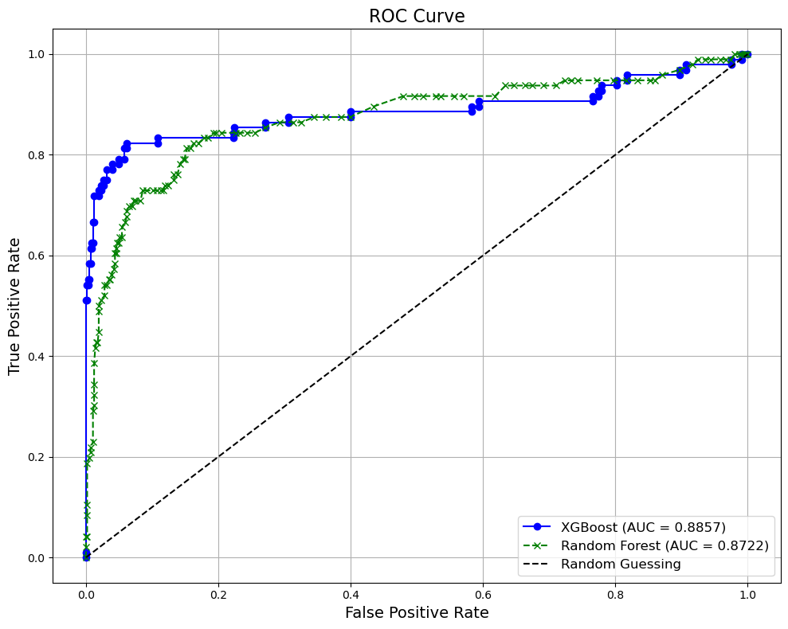
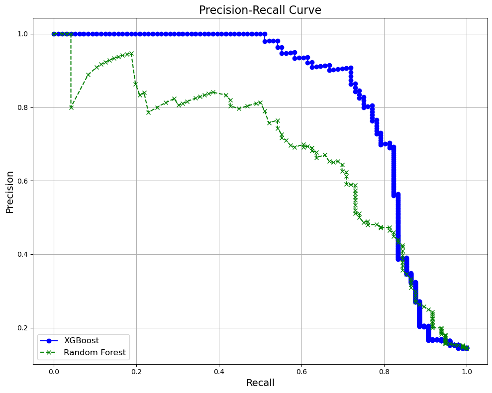

# Customer Churn Prediction for SyriaTel

##  Project Overview

This project focuses on predicting customer churn for **SyriaTel**, a telecommunications company. Churn prediction is essential for reducing customer loss and improving retention strategies. The goal is to build a classification model that can identify at-risk customers before they leave the service.

## 📂 Dataset

The data  is about [Telecom ](https://www.kaggle.com/becksddf/churn-in-telecoms-dataset) from Kaggle. It contains **customer information, usage patterns, and churn labels**. It includes **demographics, service plan details, call usage statistics, and customer service interactions**. The target variable is **"churn"**, which indicates whether a customer has left the company (1 = churned, 0 = stayed).  

The dataset includes the following key features:  

### **Customer Demographics**  
- `state`: The U.S. state where the customer resides.  
- `account length`: Duration (in days) the customer has been with the company.  

### **Service Plans**  
- `international plan`: Whether the customer has an international calling plan (Yes/No).  
- `voice mail plan`: Whether the customer has a voicemail plan (Yes/No).  

### **Usage Metrics**  
- number vmail messages: Number of voicemail messages.  
- total day minutes, total day calls, total day charge: Daytime call usage.  
- total eve minutes, total eve calls, total eve charge: Evening call usage.  
- total night minutes, total night calls, total night charge: Nighttime call usage.  
- total intl minutes, total intl calls, total intl charge: International call usage.  

### **Customer Service Interactions**  
- customer service calls: Number of calls made to customer service.  

### **Target Variable**  
- churn: Whether the customer has churned (1) or not (0).  

---

##  Objective

- Develop and evaluate machine learning models to predict customer churn.
- Identify key features that influence churn.
- Provide actionable insights to help reduce churn.

---

##  Data Preprocessing

- **Feature Engineering**: Transformed and combined categorical and numerical features to improve model performance.
- **Handling Class Imbalance**: Applied **SMOTE (Synthetic Minority Over-sampling Technique)** to address class imbalance and prevent the model from favoring the majority class.
- **Encoding & Scaling**: Used **one-hot encoding** for categorical variables and **MinMax scaling** for numerical features.

---

##  Machine Learning Models
To find the best model:

## Baseline Model Training
We trained the models using cross-validation and assessed their performance:

Logistic Regression: F1-score: 0.9054

Random Forest: F1-score: 0.9245

XGBoost: F1-score: 0.9508

Since predicting churn correctly is more valuable to the business than just overall accuracy, F1-score and recall were prioritized.

---
## **Model Hyperparameter Tuning**  
To identify the most effective model, we optimized **Logistic Regression, Random Forest, and XGBoost** using **GridSearchCV** with **five-fold cross-validation**. The tuning process focused on selecting the best hyperparameters to maximize the **F1-score**, which balances precision and recall—essential for churn prediction where false negatives are costly.  

### **Hyperparameter Choices & Rationale**  

#### **Logistic Regression**  
- **Regularization Strength (`C`)**: Helps prevent overfitting and ensures better generalization.  
- **Solver Selection**: Chosen based on dataset characteristics for efficient optimization.  
- **Penalty Term (`l2`, `elasticnet`)**: Used to handle feature collinearity and encourage sparsity when needed.  

#### **Random Forest**  
- **Number of Trees (`n_estimators`)**: More trees improve performance but increase computation time.  
- **Tree Depth (`max_depth`)**: Limits model complexity to prevent overfitting.  
- **Minimum Samples per Split (`min_samples_split`)**: Controls how the tree grows to ensure meaningful splits.  

#### **XGBoost**  
- **Number of Boosting Rounds (`n_estimators`)**: Determines the number of iterations for learning.  
- **Learning Rate (`learning_rate`)**: Adjusts step size to balance convergence speed and accuracy.  
- **Tree Depth (`max_depth`)**: Controls model complexity to balance bias and variance.  

After hyperparameter tuning, the best models were selected based on their **F1-score on the validation set**

## **Machine Learning Models Used**
These best models were trained and evaluated:
1. **Random Forest Classifier**
2. **XGBoost Classifier** (Best-performing model)

## 📈 Model Evaluation: Confusion Matrices

Below are the confusion matrices for each model:

**Key Observations**:
 **Best Model for SyriaTel’s Churn Prediction: XGBoost**  
 
1. **True Negatives (TN: 563)**  
   - These are customers who did **not churn**, and the model correctly predicted them as **not churning**.  
   -  **Good for business** since we don't waste retention efforts on these customers.  

2. **False Positives (FP: 8)**  
   - These are customers who **did not churn**, but the model predicted them as **churners**.  
   - ⚠️ **Minor business impact** as we might unnecessarily offer retention discounts to these customers.  

3. **False Negatives (FN: 27)**  
   - These are customers who **actually churned**, but the model **failed to detect them**.  
   - ❌ **Biggest concern** because these customers leave without any intervention.  

4. **True Positives (TP: 69)**  
   - These are customers who **actually churned**, and the model correctly predicted them.  
   -  **Critical for retention efforts** since we can now target these customers with offers or support to prevent churn.  

---

## 📉 ROC Curve Analysis

Below is the **ROC Curve** comparing the performance of all models:

1. **Higher AUC for XGBoost (0.8857) vs. Random Forest (0.8722)**
   - AUC (Area Under the Curve) represents the model’s ability to separate churners from non-churners.
   - **XGBoost performs better** since it has a slightly higher AUC.

2. **XGBoost has a Steeper Initial Rise**
   - The **True Positive Rate (TPR)** increases quickly with a low **False Positive Rate (FPR)**.
   - This means XGBoost identifies churners **more efficiently and accurately** with fewer false alarms.

3. **Random Forest Lags in Early TPR Gains**
   - The orange line (Random Forest) starts lower but later catches up.
   - This means Random Forest **misclassifies more customers initially** before improving at higher thresholds.

4. **Both Models Outperform Random Guessing**
   - The **dashed diagonal line** represents a random classifier (AUC = 0.5).
   - Since both AUCs are above 0.85, **both models perform well**, but XGBoost is superior.
---

## Model Evaluation: Precision-Recall Curves

1. **XGBoost Outperforms Random Forest**  
   - XGBoost maintains **higher precision at every recall level** compared to Random Forest.  
   - This means XGBoost is better at identifying churners while keeping false positives low.  

2. **XGBoost Retains High Precision Even at High Recall**  
   - In the **0.6 to 0.9 recall range**, XGBoost has significantly higher precision.  
   - This is crucial for SyriaTel because we want to catch as many churners as possible **without misclassifying too many loyal customers**.  

3. **Random Forest Drops in Precision Quickly**  
   - The  curve shows that as recall increases, precision decreases much faster.  
   - This suggests that Random Forest is making more **false positive churn predictions**, which could lead to wasted retention resources.  

Given the business need to accurately detect potential churners (minimizing false negatives), <em>XGBoost<em> was chosen as the final model due to its superior precision-recall balance

---

##  Business Impact & Recommendations

1. **Retention Strategy Optimization**:
   - Focus retention efforts on customers with high churn probability (as identified by the model).
   - Improve customer experience for users making frequent customer service calls.
2. **Service Plan Enhancements**:
   - Customers with **no voice mail plans** have a higher churn risk—consider promotions to encourage adoption.
   - International plan subscribers show varying churn behavior—optimize offers based on usage trends.
3. **Predictive Monitoring**:
   - Deploy the XGBoost model in production to monitor churn risk in real-time.
   - Set up alerts for customers exceeding churn probability thresholds.

---

## 🏗️ Technologies Used

- **Python** (pandas, numpy, seaborn, matplotlib, scikit-learn, XGBoost, LightGBM)
- **Jupyter Notebook**
- **GridSearchCV & RandomizedSearchCV** (for hyperparameter tuning)

---

##  How to Run the Notebook

To run the notebook, follow these steps:

1. **Clone the Repository**:
   

git clone https://github.com/blexolonde//Customer-Churn-Prediction-for-SyriaTel
  

2. **Install Dependencies**:
   

pip install -r requirements.txt

3. **Run the Jupyter Notebook**:
   

Customer-Churn-Prediction-for-SyriaTel.ipynb

Ensure you have all dependencies installed. If you encounter any issues, feel free to check the troubleshooting section below or open an issue on GitHub.

---

##  Future Work

- Enhance the model with **feature selection** and **ensemble techniques**.
- Collect more behavioral data for better predictions and insights into customer churn.
- Deploy the model for real-time churn prediction in a production environment.

---

## 📄 License

This project is licensed under the MIT License - see the [LICENSE](LICENSE) file for details.

---

##  Conclusion

This project developed a robust **customer churn prediction model** using multiple machine learning algorithms. **Random Forest** and **xgboost** emerged as the best models for churn prediction, showing strong performance across key metrics. With further refinement and deployment, this model will assist SyriaTel in reducing churn and improving customer retention strategies.

---

## 📬 Contact

For any inquiries or collaboration opportunities, feel free to reach out!

📧 Email: [olonde.blex@gmail.com]  

---
