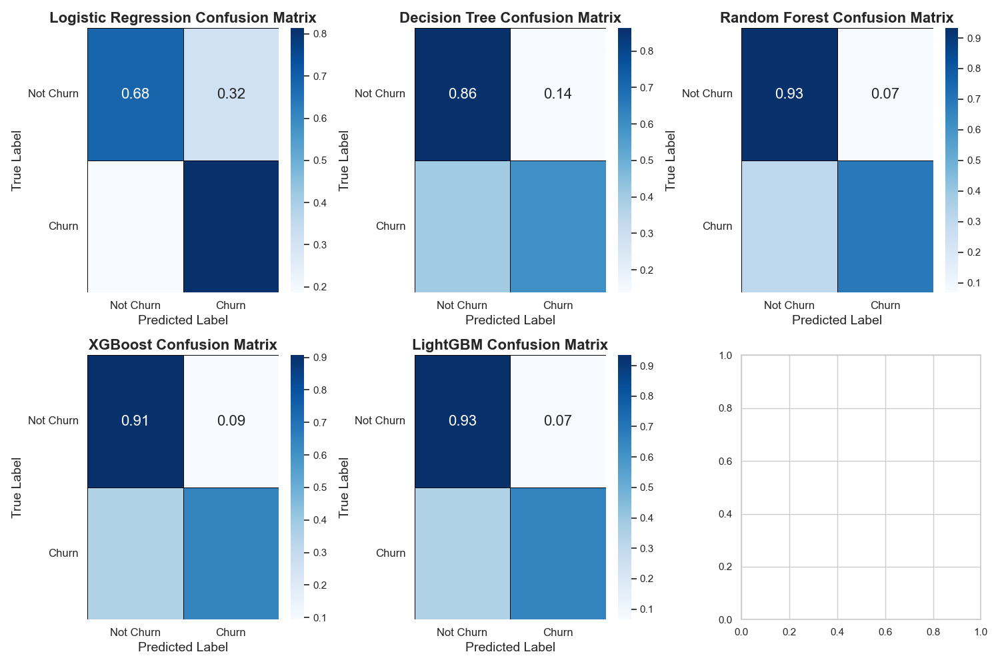
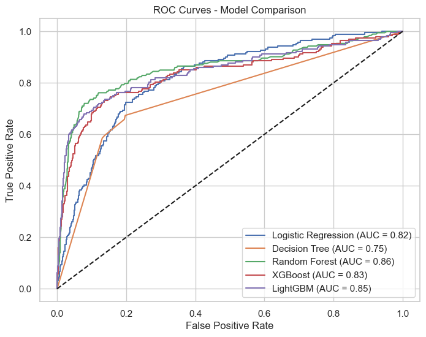

# Customer Churn Prediction for SyriaTel

## 📌 Project Overview

This project focuses on predicting customer churn for **SyriaTel**, a telecommunications company. Churn prediction is essential for reducing customer loss and improving retention strategies. The goal is to build a classification model that can identify at-risk customers before they leave the service.

## 📂 Dataset

The dataset is sourced from Kaggle and contains **customer information, usage patterns, and churn labels**. It includes **demographics, service plan details, call usage statistics, and customer service interactions**. The target variable is **"churn"**, which indicates whether a customer has left the company (1 = churned, 0 = stayed).  

The dataset includes the following key features:  

### **Customer Demographics**  
- state: The U.S. state where the customer resides.  
- account length: Duration (in days) the customer has been with the company.  

### **Service Plans**  
- international plan: Whether the customer has an international calling plan (Yes/No).  
- voice mail plan: Whether the customer has a voicemail plan (Yes/No).  

### **Usage Metrics**  
- number vmail messages: Number of voicemail messages.  
- total day minutes, total day calls, total day charge: Daytime call usage.  
- total eve minutes, total eve calls, total eve charge: Evening call usage.  
- total night minutes, total night calls, total night charge: Nighttime call usage.  
- total intl minutes, total intl calls, total intl charge: International call usage.  

### **Customer Service Interactions**  
- customer service calls: Number of calls made to customer service.  

### **Target Variable**  
- churn: Whether the customer has churned (1) or not (0).  

---

## 🎯 Objective

- Develop and evaluate machine learning models to predict customer churn.
- Identify key features that influence churn.
- Provide actionable insights to help reduce churn.

---

## 📊 Data Preprocessing

- **Feature Engineering**: Transformed and combined categorical and numerical features to improve model performance.
- **Handling Class Imbalance**: Applied **SMOTE (Synthetic Minority Over-sampling Technique)** to address class imbalance and prevent the model from favoring the majority class.
- **Encoding & Scaling**: Used **one-hot encoding** for categorical variables and **MinMax scaling** for numerical features.

---

## 🏆 Machine Learning Models

Five classification models were trained and optimized through **hyperparameter tuning**. Here is a comparison of model performance:

### Model Performance Comparison:

| Model                        | Accuracy | Precision | Recall | F1-score | ROC-AUC |
| ---------------------------- | -------- | --------- | ------ | -------- | ------- |
| Logistic Regression          | 70.3%    | 30.4%     | 81.3%  | 44.2%    | 81.8%   |
| Decision Tree Classifier     | 82.4%    | 42.3%     | 59.6%  | 49.5%    | 75.2%   |
| Random Forest Classifier     | 89.7%    | 63.0%     | 68.9%  | 65.8%    | 85.8%   |
| LightGBM                     | 89.4%    | 62.9%     | 65.8%  | 64.3%    | 84.6%   |
| XGBoost                      | 86.9%    | 53.9%     | 64.8%  | 58.8%    | 83.4%   |

**Key Insights**:
- The **Random Forest model** performed the best with **89.7% accuracy** and the highest **ROC-AUC (85.8%)**, making it the ideal choice for predicting customer churn.
- **LightGBM** also performed well but showed slightly lower recall and ROC-AUC.
- **Logistic Regression** performed the worst, with a significant drop in precision.

### Best Hyperparameters for Each Model

Sure! Here's how you can add the **Hyperparameter Tuning and Rationale** section to your README, right after the **Model Performance Comparison**:

---

### Best Hyperparameters for Each Model

Hyperparameters were selected using **Random Search** optimization, aiming to balance **precision, recall, and F1-score**:

- **Logistic Regression**: solver='liblinear', penalty='l1', C=0.1
- **Decision Tree**: min_samples_split=5, min_samples_leaf=2, max_depth=None
- **Random Forest**: n_estimators=500, min_samples_split=2, min_samples_leaf=1, max_depth=None
- **LightGBM**: subsample=0.7, num_leaves=40, n_estimators=500, learning_rate=0.1, boosting_type='gbdt'
- **XGBoost**: subsample=0.8, n_estimators=500, max_depth=6, learning_rate=0.2

### Hyperparameter Tuning and Rationale

I improved the models performance by selecting the best configuration for each algorithm. Below are the hyperparameters tuned for each model along with the rationale behind their selection.

#### 1. **Logistic Regression**
   **Hyperparameters**:
   - `C`: Regularization strength, where smaller values mean more regularization. We tested values from **0.001 to 100** to balance model complexity and overfitting.
   - `penalty`: Regularization type, either `l1` or `l2`. `L1` encourages sparsity (useful for feature selection), while `L2` helps with stability and performance when using many features. We chose both options to evaluate which works best for the dataset.
   - `solver`: The solver used for optimization. We selected `liblinear` as it's efficient for smaller datasets and supports `l1` regularization.

   **Reasoning**: The goal was to balance regularization and overfitting, while ensuring the logistic regression model can effectively handle the features. The `liblinear` solver is a good choice when the dataset is relatively small to medium-sized.

#### 2. **Decision Tree Classifier**
   **Hyperparameters**:
   - `max_depth`: Controls the depth of the tree. Testing values **3, 6, 10, None** allowed us to see if limiting the depth prevents overfitting while maintaining predictive power.
   - `min_samples_split`: Minimum samples required to split an internal node. We tested **2, 5, and 10** to prevent the tree from becoming too sensitive to small splits.
   - `min_samples_leaf`: Minimum samples required to be at a leaf node. We chose **1, 2, and 4** to avoid overfitting and allow for better generalization.

   **Reasoning**: The decision tree is prone to overfitting, so hyperparameters were chosen to control the tree's complexity. Limiting the depth and controlling the leaf nodes ensures that the tree remains interpretable and robust.

#### 3. **Random Forest Classifier**
   **Hyperparameters**:
   - `n_estimators`: The number of trees in the forest. We tried **100, 300, 500** to balance computational efficiency and performance. More trees often improve accuracy but also increase computation.
   - `max_depth`: The maximum depth of each tree. We used **3, 6, 10, None** to prevent overfitting and improve generalization.
   - `min_samples_split`: Minimum number of samples required to split an internal node, with values **2, 5, 10** to ensure stability.
   - `min_samples_leaf`: Minimum number of samples required to be at a leaf node, using values **1, 2, 4** to reduce model overfitting.

   **Reasoning**: Random Forest benefits from a large number of estimators. The hyperparameters were chosen to strike a balance between model performance and computational cost, with a focus on limiting overfitting.

#### 4. **XGBoost**
   **Hyperparameters**:
   - `n_estimators`: Number of boosting rounds. We tested **100, 300, 500** to evaluate the trade-off between computation time and model performance.
   - `max_depth`: Controls the maximum depth of a tree. We selected **3, 6, and 10** to manage overfitting while keeping the model robust.
   - `learning_rate`: Step size shrinking, set to **0.01, 0.1, and 0.2** to prevent overfitting and improve convergence.
   - `subsample`: Proportion of data used for training each tree. We tested **0.7, 0.8, and 1.0** to control variance.

   **Reasoning**: XGBoost is known for its high performance, so these hyperparameters were chosen to fine-tune its ability to prevent overfitting, balance bias and variance, and ensure faster convergence without sacrificing accuracy.

#### 5. **LightGBM**
   **Hyperparameters**:
   - `n_estimators`: Number of boosting rounds. We used **100, 300, and 500** to balance performance and efficiency.
   - `learning_rate`: Step size used for gradient descent. Values **0.01, 0.1, and 0.2** were tested to minimize overfitting.
   - `boosting_type`: Type of boosting algorithm, with options **'gbdt'** (Gradient Boosting Decision Tree) and **'dart'** (Dropouts meet Multiple Additive Regression Trees). We evaluated both to see which one performs better with the given dataset.
   - `num_leaves`: The number of leaves in each tree, with values **20, 31, 40** to control tree complexity.
   - `subsample`: Fraction of data used for training each tree, tested at **0.7, 0.8, 1.0** to avoid overfitting.

   **Reasoning**: LightGBM is designed for speed and efficiency. The hyperparameters were chosen to enhance the model's predictive capabilities while controlling overfitting. The choice of boosting type was crucial to see whether 'dart' could outperform 'gbdt' on this dataset.

---

## 📈 Model Evaluation: Confusion Matrices

Below are the confusion matrices for each model:

**Key Observations**:
- **Churn Rate**: The dataset has a relatively low churn rate, with fewer actual churn cases.
- **False Positives (FP)**: Some models, like Logistic Regression, misclassify customers who stay as churned.
- **False Negatives (FN)**: Missing customers who actually churn is a risk, especially for business strategy.

---

## 📉 ROC Curve Analysis

Below is the **ROC Curve** comparing the performance of all models:

**Interpretation**:
- **Random Forest (AUC = 0.86)** and **LightGBM (AUC = 0.85)** perform the best, indicating strong predictive capabilities.
- **XGBoost (AUC = 0.83)** and **Logistic Regression (AUC = 0.82)** perform reasonably well but are less optimal.
- **Decision Tree (AUC = 0.76)** shows weaker predictive power, making it less reliable for churn prediction.

---

## 📊 Model Evaluation: Precision-Recall Curves

### Key Insights:
- **LightGBM** has the best **precision-recall balance**, with the highest **Average Precision (AP = 0.65)**, meaning it correctly identifies churners with minimal false positives.
- **Random Forest** follows with an **AP = 0.62**, also providing a good balance between precision and recall.
- **XGBoost** (AP = 0.60) and **Decision Tree** (lower AP) perform worse in identifying churners with minimal false positives.

---

## 🚀 Business Impact & Recommendations

Based on the findings, the following actions are recommended:
- **Customer Retention Programs**: Focus on high-risk churn customers by offering personalized promotions or discounts.
- **Improve Customer Support**: Customers with frequent customer service calls or varying usage patterns may need enhanced support.
- **Feature Optimization**: Further investigate key features such as customer service calls and international plan to improve churn prediction.
- **Threshold Tuning**: Adjust classification thresholds based on business needs to balance false positives and false negatives.

---

## 🏗️ Technologies Used

- **Python** (pandas, numpy, seaborn, matplotlib, scikit-learn, XGBoost, LightGBM)
- **Jupyter Notebook**
- **SHAP** (for model interpretability)
- **GridSearchCV & RandomizedSearchCV** (for hyperparameter tuning)

---

## 🚀 How to Run the Notebook

To run the notebook, follow these steps:

1. **Clone the Repository**:
   

git clone https://github.com/your-username/churn-prediction.git
   cd churn-prediction

2. **Install Dependencies**:
   

pip install -r requirements.txt

3. **Run the Jupyter Notebook**:
   

jupyter notebook churn_prediction.ipynb

Ensure you have all dependencies installed. If you encounter any issues, feel free to check the troubleshooting section below or open an issue on GitHub.

---

## 📌 Future Work

- Enhance the model with **feature selection** and **ensemble techniques**.
- Collect more behavioral data for better predictions and insights into customer churn.
- Deploy the model for real-time churn prediction in a production environment.

---

## 📄 License

This project is licensed under the MIT License - see the [LICENSE](LICENSE) file for details.

---

## 📌 Conclusion

This project developed a robust **customer churn prediction model** using multiple machine learning algorithms. **Random Forest** and **LightGBM** emerged as the best models for churn prediction, showing strong performance across key metrics. With further refinement and deployment, this model can assist SyriaTel in reducing churn and improving customer retention strategies.

---

## 📬 Contact

For any inquiries or collaboration opportunities, feel free to reach out!

📧 Email: [olonde.blex@gmail.com]  

---